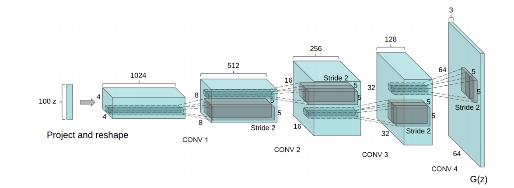
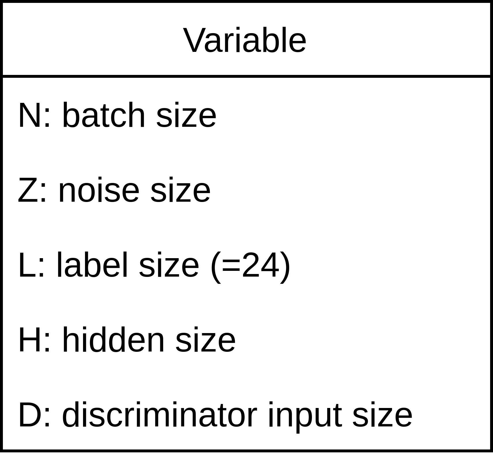
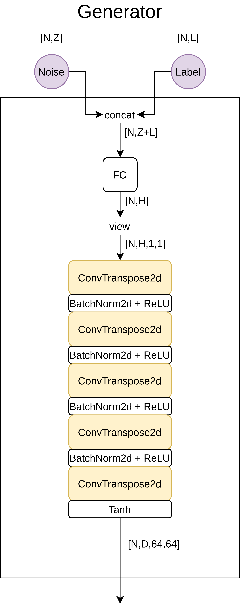
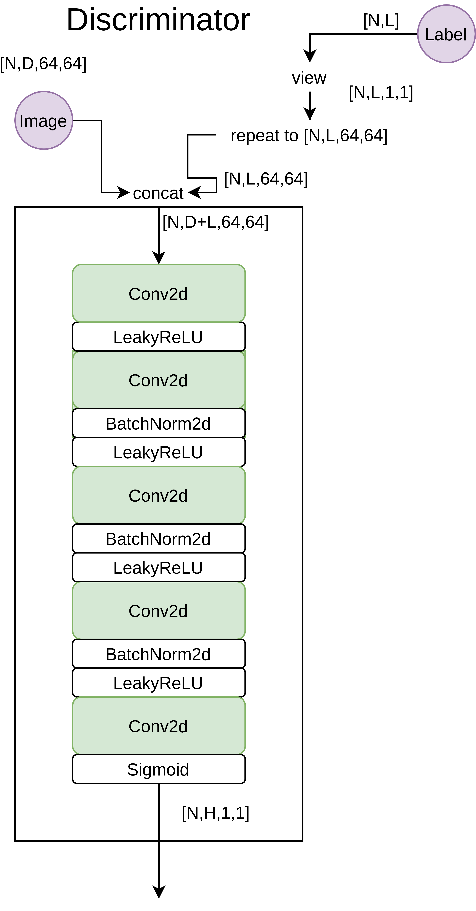
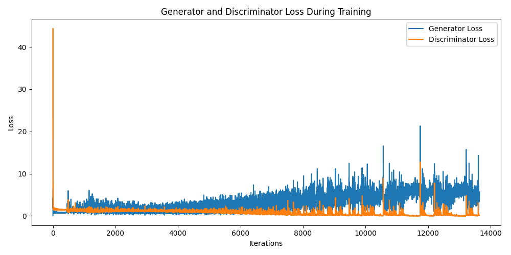
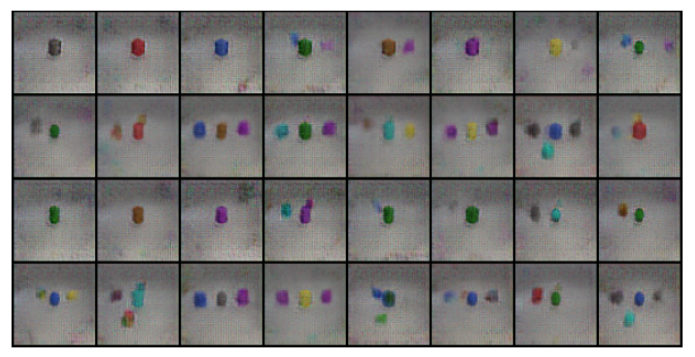
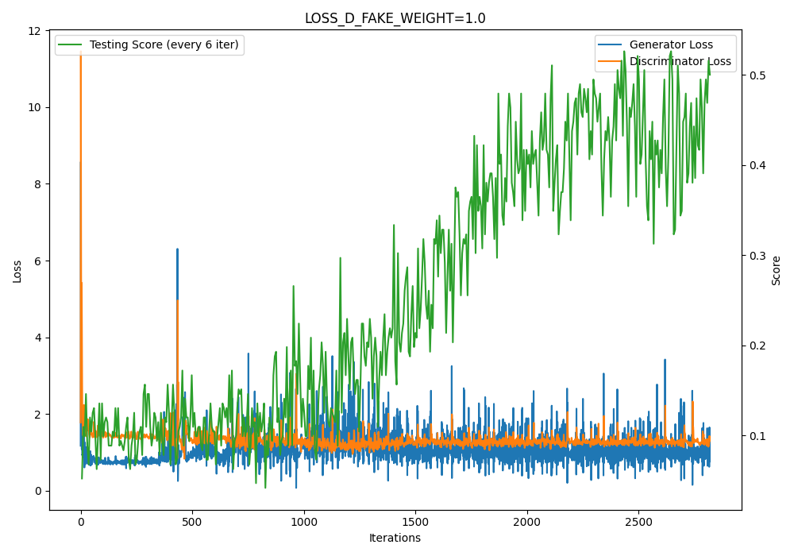
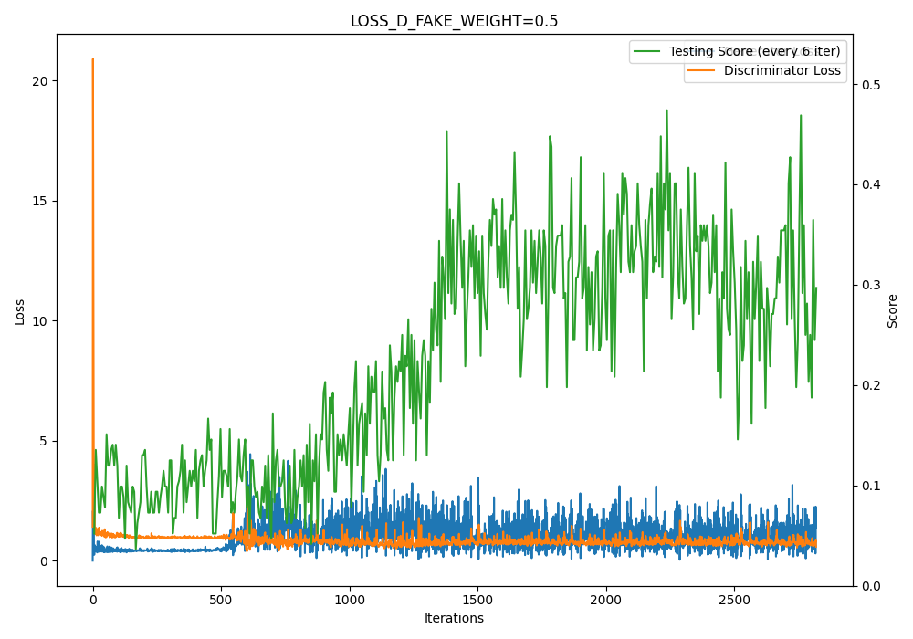
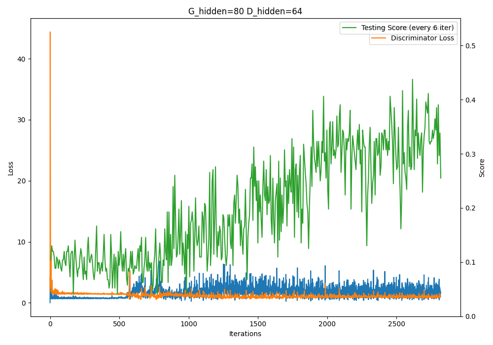
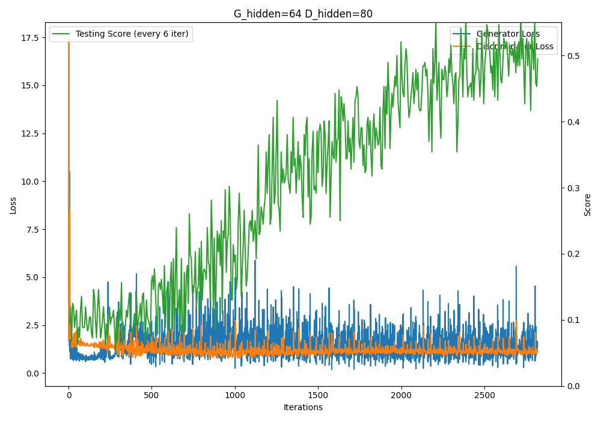

# cGAN-CLEVR

## Introduction

Conditional GAN: 我們要能夠在給定 class label 的情況下，讓 generator 產生相應的圖片。以下實驗使用 CLEVR 資料集，此資料集的圖片內包含了不同顏色/不同形狀的物體，共有 24 個種類，每張圖片可能包含不只一種物體。Evaluate 的方式則是使用 pretrained classifier 來對圖片進行分類，看 GAN 產出的圖片能否被 classifier 成功分類回原本產生圖片用的 labels。

## Implementation Details

### Model Structures: DCGAN + Extra Label Input

架構主要參考以下兩篇文章的設計：

- [https://pytorch.org/tutorials/beginner/dcgan_faces_tutorial.html](https://pytorch.org/tutorials/beginner/dcgan_faces_tutorial.html)
- [https://clay-atlas.com/blog/2019/10/24/pytorch-教學-image-dcgan-利用生成對抗網路生成圖片/](https://clay-atlas.com/blog/2019/10/24/pytorch-%E6%95%99%E5%AD%B8-image-dcgan-%E5%88%A9%E7%94%A8%E7%94%9F%E6%88%90%E5%B0%8D%E6%8A%97%E7%B6%B2%E8%B7%AF%E7%94%9F%E6%88%90%E5%9C%96%E7%89%87/)

這兩篇講述的是幾乎一樣 DCGAN，但是缺少 conditional 的部分，conditional 的部分是參考 [https://github.com/eriklindernoren/PyTorch-GAN/blob/master/implementations/cgan/cgan.py](https://github.com/eriklindernoren/PyTorch-GAN/blob/master/implementations/cgan/cgan.py) 的設計，並和前面文章的設計整合在一起。

模型架構可以分成 generator 和 discriminator 兩者，各自的主體設計採用 DCGAN 的架構，但加入了 conditional 的元素。Conditional 加入的方式為在 generator 和 discriminator 的 input 再多一項表示 class label 的 tensor。



DCGAN paper 的 generator 設計。圖片來源：[https://arxiv.org/pdf/1511.06434.pdf](https://arxiv.org/pdf/1511.06434.pdf)



下圖用到的名詞解釋

整合後的架構如下面的圖。

中括號表示 tensor 的 shape。紫色圓形為 forward 時的 input。






### Loss Function

- Discriminator loss = discriminator 看真實圖片對真實度評分的 BCELoss + discriminator 看 generator 產生的圖片對真實度評分的 BCELoss
- Generator loss = generator 產生的圖片讓 discriminator 對真實度評分的 BCELoss

### Hyper-Parameters

```python
# Attributes
BATCH_SIZ = 128
IMG_SIZ = 64  # 圖片長&寬 (正方形)
G_out_D_in = 3  # Generator's number of output channels
G_in = 100  # Generator's input noise length
G_hidden = 80  # 控制 size
D_hidden = 64

epochs = 100 # 看狀況設。而且因為主要在 python console 練，隨時可以暫停並繼續練。
lr = 0.001  # Learning rate
beta1 = 0.5  # Adam optimizer 的參數

# Loss fuG_out_D_init
criterion = nn.BCELoss()  # Binary cross entropy loss
LOSS_D_REAL_WEIGHT = 1.0  # Discriminator 看 real img 的 loss 權重
LOSS_D_FAKE_WEIGHT = 1.0  # Discriminator 看 fake img 的 loss 權重

N_DISCRIMINATOR_TIMES = 1  # 每個 iter 要經過幾次 discriminator 的訓練
N_GENERATOR_TIMES = 1  # 每個 iter 要經過幾次 generator 的訓練
```


## Results

### Training Curve

這個圖是使用前面提到的 hyper-parameter 設定練出來的。每 6 個 iteration 算一次 testing score 及印出 loss，練最大到 100 epochs。這樣的訓練最好的 testing score 為 0.6041666666666666 (發生在第 96 epochs 又 108 iteration。註：141個 iteration 一個 epoch)。




其中一個模型生成的圖型：




## Discussion

### Loss 比例實驗

調整`LOSS_D_FAKE_WEIGHT` 的大小。`LOSS_D_FAKE_WEIGHT`指的是 discriminator 學習 fake image 的 loss 權重。固定其它參數，實驗以下兩組：

- LOSS_D_FAKE_WEIGHT = 1.0
- LOSS_D_FAKE_WEIGHT = 0.5

各練 20 epochs，每 6 個 iteration 算一次 testing score。固定的參數如下：

```python
BATCH_SIZ = 128
IMG_SIZ = 64  # 圖片長&寬 (正方形)
G_out_D_in = 3  # Generator's number of output channels
G_in = 20  # Generator's input noise length
G_hidden = 64  # 控制 size
D_hidden = 64

lr = 0.001  # Learning rate
beta1 = 0.5  # Adam optimizer 的參數

LOSS_D_REAL_WEIGHT = 1.0  # Discriminator 看 real img 的 loss 權重
LOSS_D_FAKE_WEIGHT = 本實驗變因  # Discriminator 看 fake img 的 loss 權重

N_DISCRIMINATOR_TIMES = 1  # 每個 iter 要經過幾次 discriminator 的訓練
N_GENERATOR_TIMES = 1  # 每個 iter 要經過幾次 generator 的訓練
```



Best testing score: 0.515625



Best: 0.473

從結果能夠發現，`LOSS_D_FAKE_WEIGHT` 比較小的能稍微快一點上到 0.3 的分數，但是後繼無力，後面就大概都停在0.3x，而`LOSS_D_FAKE_WEIGHT`= 1.0 的則比較有持續上升的趨勢。所以結論是：早期可能比較沒有差，但後期這樣調回比較不會。

### G_hidden vs D_hidden

實驗中，發現訓練到後面往往 generator 的 loss 會處在比 discriminator loss 大的狀態，而且 D(G(x)) 會變得很小，似乎表示 generator 已經做不出能讓 discriminator 辨識不出來的圖了。所以說不定更改模型複雜度，讓 generator 或 discriminator 其中一方的複雜度變大，可能可以影響到最後的平衡關係。實驗的方法為「調整 hidden size 大小」。調整的組合如下：

1. Generator hidden size = 80，discriminator hidden size = 64
2. Generator hidden size = 64，discriminator hidden size = 80

其它固定的參數：

```python
BATCH_SIZ = 128
IMG_SIZ = 64  # 圖片長&寬 (正方形)
G_out_D_in = 3  # Generator's number of output channels
G_in = 100  # Generator's input noise length

lr = 0.001  # Learning rate
beta1 = 0.5  # Adam optimizer 的參數

LOSS_D_REAL_WEIGHT = 1.0  # Discriminator 看 real img 的 loss 權重
LOSS_D_FAKE_WEIGHT = 本實驗變因  # Discriminator 看 fake img 的 loss 權重

N_DISCRIMINATOR_TIMES = 1  # 每個 iter 要經過幾次 discriminator 的訓練
N_GENERATOR_TIMES = 1  # 每個 iter 要經過幾次 generator 的訓練
```

結果：



Best score: 0.4375



Best score: 0.5625

可以發現 discriminator 的 hidden size 較大的那組明顯 testing score 的表現較好。這個結果滿出乎意料的，沒想到 generator hidden size 較大的反而 score 比較上不去。這讓我聯想到上課有提到可以讓 discriminator 練的次數多一點。讓 discriminator 強一點說不定是個好方法。


## Preparation 

由於本實驗預訓練分類器並非本文作者所產出，在此不提供，可以自己訓練或找看看有沒有可用的預訓練模型~  
嘗試訓練前，請先下載 CLEVR 資料集，並且把以下檔案準備好，然後改 `main.py` 裡面設定檔案途徑的變數。`test.json` 裡面的測試題目也可以自己設計。

- `train.json`: dict which describes labels of all training images. E.g.
  ```
  {"CLEVR_train_002066_0.png": ["cyan cube"], "CLEVR_train_002066_1.png": ["cyan cube", "cyan sphere" ......
  ```
- `test.json`: dict which describes testing cases. E.g.
  ```
  [["gray cube"], ["red cube"], ["blue cube"], ["blue cube", "g ......
  ```
- `objects.json': dict which describe each class's label number. E.g.
  ```
  {"gray cube": 0, "red cube": 1, "blue cube": 2, ......
  ```
- `clevr_data/images`: put all images in this path. 
